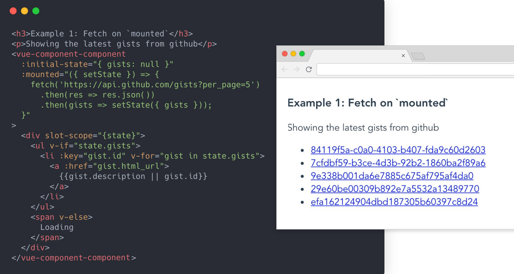

# vue-component-component

<p align="center">


[](https://github.com/koca/vue-component-component)
[](https://circleci.com/gh/koca/vue-component-component/tree/master)


</p>

Vue version of [@Reach/component-component](https://github.com/reach/reach-ui/). 

> A dynamic version of Vue.Component, a component component if you will. Useful for inline lifecycles and state. It's also incredibly composable.



## Example

A Todo App:

```html
<vue-component :initial-state="{ newTodo: 'work', items:[]}">
  <div slot-scope="{ state }">
    What to do?:
    <input type="text" ref="inp" v-model="state.newTodo">
    <button
      @click="()=>{
        state.items.push(state.newTodo)
        state.newTodo = '';
        $refs.inp.focus();
      }"
    >Add</button>
    <br>
    <ul>
      <li :key="item" v-for="item in state.items">{{item}}</li>
    </ul>
  </div>
</vue-component>
```

More Examples on [Codesandbox](https://codesandbox.io/s/01r8wko0v0).

## Install

```sh
npm install vue-component-component
```

or

```sh
yarn add vue-component-component
```

## Usage

Register the component locally and use it (recommended)

```js
import Component from "vue-component-component";
export default {
  components: {
    // ⚠️ `<component>` tag is reserved by vue
    "vue-component": Component
  }
};
```

Or register the component globally in `main.js`

```js
import Component from "vue-component-component";
Vue.component("vue-component", Component);
```

Browser usage:

```html
<!-- vue-component-component JavaScript -->
<script src="https://unpkg.com/vue-component-component"></script>

<!-- use -->
<script>
Vue.component('vue-component', VueComponent)
new Vue({
    el: '#app'
})
</script>
```

## Props

| Name                       | Type       | Default | Description                                                                                                  |
| -------------------------- | ---------- | ------- | ------------------------------------------------------------------------------------------------------------ |
| initialState               | `object`   | `{}`    | initial state aka `data: ()=> ({})`                                                                          |
| created                    | `Function` | -       | Called when the component is created.                                                                        |
| mounted                    | `Function` | -       | Called when the component is mounted.                                                                        |
| All other Life Cycle Hooks | `Function` | -       | "beforeMount", "mounted", "beforeUpdate", "updated", "activated", "deactivated", "beforeDestroy","destroyed" |


## Scoped Slots

| **Name**  | **Description**                    |
| --------- | ---------------------------------- |
| `default` | Here the content will be rendered. |

### Slot Properties and Function Args 

All the life cycle hooks(mounted, created etc.) and the default slot scope gets the args/props below.

| **Property** | **Type**   | **Description**                     |
| ------------ | :--------: | ----------------------------------- |
| `state`      | `Object`   | State of the component a.k.a `data` |
| `setState`   | `Function` | A function to set the state         |


## About

Inspired by [@Reach/component-component](https://github.com/reach/reach-ui/).
Thanks [Ryan](https://twitter.com/ryanflorence) 👍

## Todos

- Refs?

## Author

**vue-component-component** © [koca](https://github.com/koca), Released under the [MIT](./LICENSE) License.<br>
Authored and maintained by koca with help from contributors ([list](https://github.com/koca/vue-component-component/contributors)).

> [mesutkoca.com](https://mesutkoca.com) · GitHub [@koca](https://github.com/koca) · Twitter [@imesutkoca](https://twitter.com/imesutkoca)
